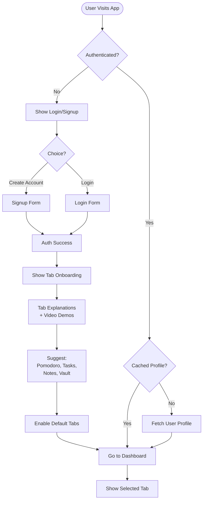
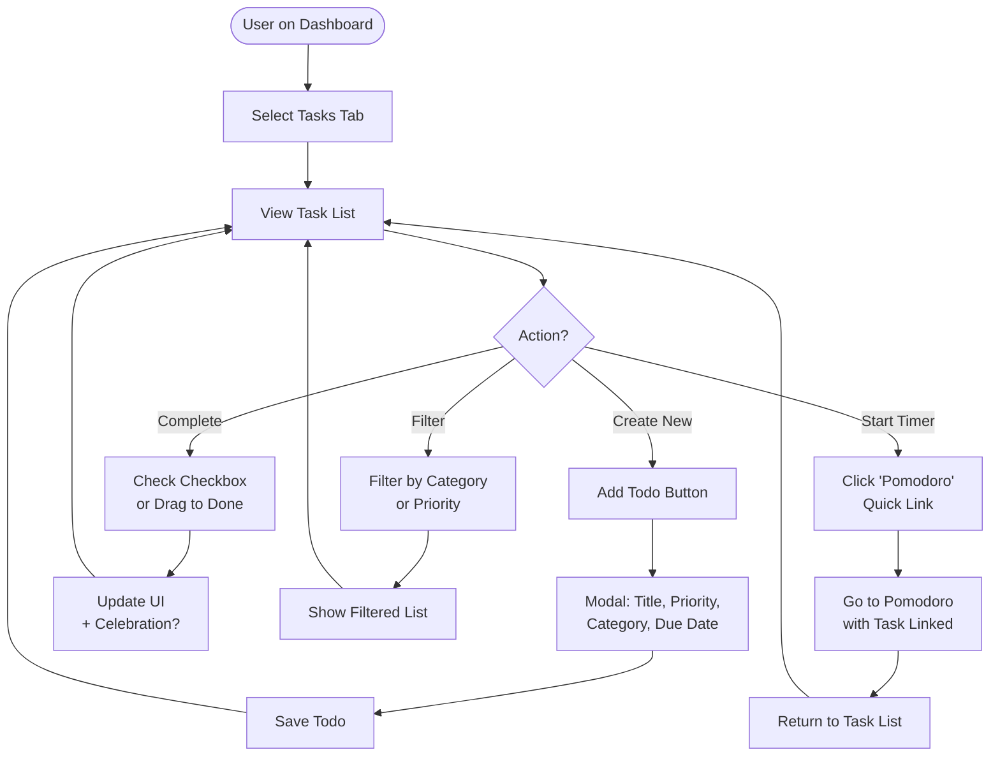
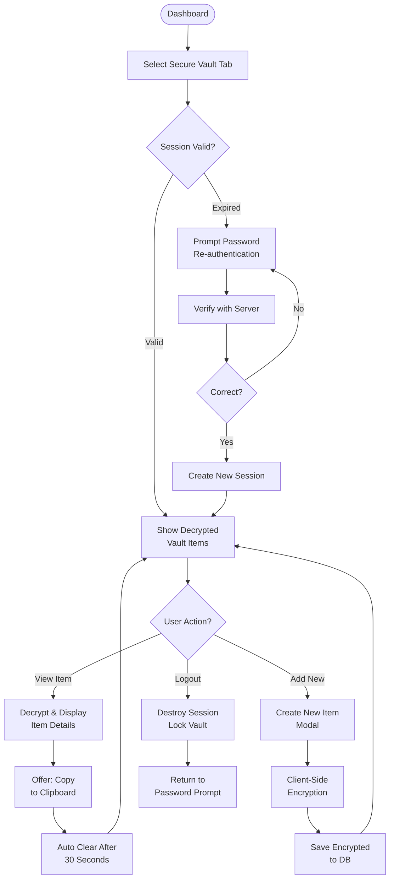
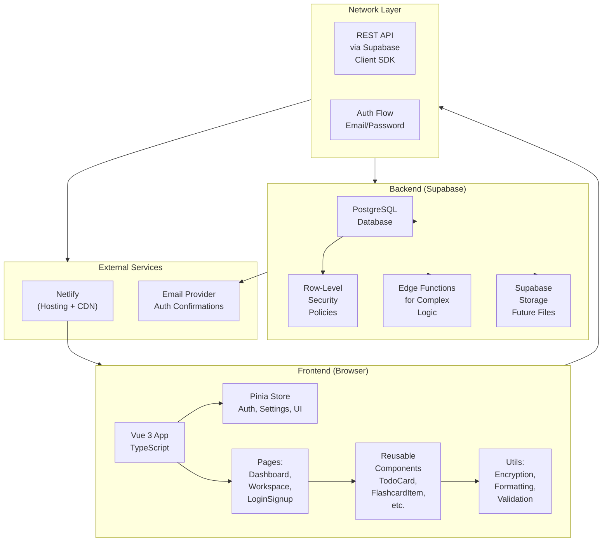
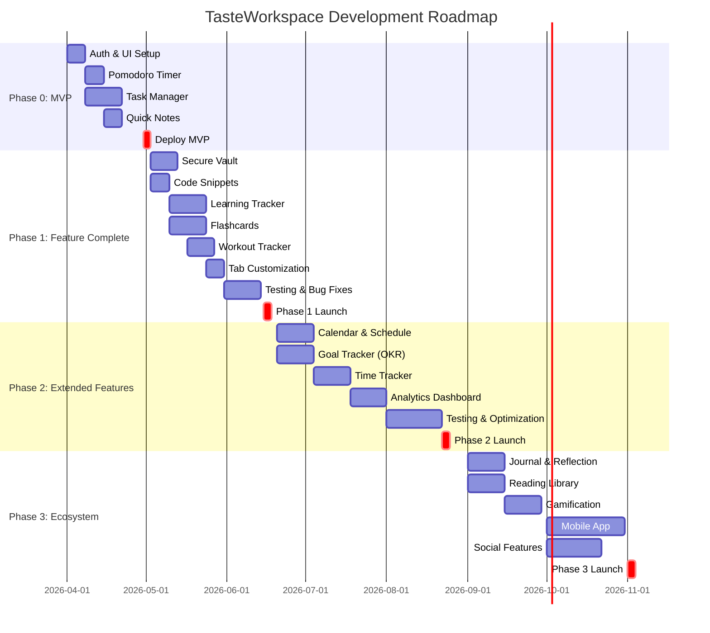

# TasteWorkspace – Master Project Specification

**Last Updated**: April 2026  
**Status**: Living Documentation (v1.0)  
**Audience**: Development team, AI coding agents, project stakeholders

---

## 1. Project Overview & Vision

### 1.1 Elevator Pitch
**TasteWorkspace** is a comprehensive, privacy-first personal productivity suite designed for students, developers, and knowledge workers. It combines task management, focus timers, secure note storage, code snippets, learning tools, and habit tracking in a unified, extensible tab-based interface with a modern dark UI and multi-language support.

### 1.2 Project Goals & Success Metrics (SMART)

| Goal | Success Metric | Target |
|------|----------------|--------|
| **MVP Launch** | Complete core 4 modules (Pomodoro, Tasks, Quick Notes, Auth) | Q2 2026 |
| **User Adoption** | 100+ active users in beta phase | Q3 2026 |
| **Features Depth** | Achieve Phase 1 (8 modules fully functional) | Q3 2026 |
| **Performance** | <1.5s initial load, <200ms API response | Ongoing |
| **Security** | 100% RLS coverage, zero unauthorized data access | Ongoing |
| **Code Quality** | >80% test coverage, TypeScript strict mode | Ongoing |
| **Accessibility** | WCAG AA compliance for all pages | Phase 2 |

### 1.3 Target Users & Use Cases

| User Segment | Primary Use Cases | Key Needs |
|--------------|-------------------|-----------|
| **University Students** | Task tracking, exam prep, time management, learning progression | Study organization, deadline tracking, subject organization |
| **Developers/Engineers** | Code library, time tracking, focus sessions, secure API key storage | Quick snippet access, development time logging |
| **Professionals** | Task management, calendar, goal setting, time tracking | Project tracking, prioritization, productivity analytics |
| **Fitness Enthusiasts** | Workout tracking, habit logging, goal management, pomodoro breaks | Routine management, progress visualization |
| **Language Learners** | Flashcards, learning tracker, progress visualization | Spaced repetition, vocabulary tracking |
| **Guest Users** | Pomodoro timer, settings exploration | No account friction for casual use |

---

## 2. Functional Requirements

### 2.1 Feature Matrix – Prioritized Roadmap

#### **Phase 0: MVP (Current/Sprint 1) – Launch Ready**
| Feature | Module | Status | Priority | Notes |
|---------|--------|--------|----------|-------|
| Authentication (Signup/Login) | Auth | ✅ Built | CRITICAL | Supabase-based, email verification |
| Pomodoro Timer | Focus Timer | ✅ Built | CRITICAL | 25/5/15 min modes, customizable sounds/bg |
| Task Manager | Task Management | ✅ Built | CRITICAL | CRUD, categories, priorities, filtering |
| Quick Notes | Note-Taking | ✅ Built | CRITICAL | Fast capture, search |
| Settings Panel | Config | ✅ Built | HIGH | Theme, language, notifications |
| Responsive UI | UX | ✅ Built | HIGH | Mobile-first, Tailwind CSS |

#### **Phase 1 (Sprint 2–3) – Feature Complete**
| Feature | Module | Status | Priority | Notes |
|---------|--------|--------|----------|-------|
| Secure Vault | Secure Notes | 🔄 In Progress | HIGH | Session-based encryption, timeout |
| Code Library | Code Snippets | ✅ Built | HIGH | Syntax highlighting, language selection |
| Learning Tracker | Education | 🔄 In Progress | HIGH | Subject/unit/topic hierarchy, progress % |
| Flashcards | Spaced Learning | 🔄 In Progress | HIGH | Deck creation, test mode, scoring |
| Workout Tracker | Fitness | 🔄 In Progress | MEDIUM | Exercise library, routine logging |
| **Periodic Tasks (NEW)** | **Routine Management** | **✅ Built** | **HIGH** | **Daily/weekly routines, daily reset** |
| Tab Customization | UX | 📋 Planned | HIGH | Drag-reorder, add/remove tabs |
| Data Export | Data | 📋 Planned | MEDIUM | JSON/CSV export of all user data |

#### **Phase 2 (Sprint 4–6) – Extended Features**
| Feature | Module | Status | Priority | Notes |
|---------|--------|--------|----------|-------|
| **Calendar & Schedule** | Planning | 📋 Planned | HIGH | Month/week view, task deadline visualization |
| **Goal Tracker (OKR)** | Goal Management | 📋 Planned | HIGH | Long-term goals, weekly milestones, KPIs |
| **Time Tracker / Timesheet** | Analytics | 📋 Planned | MEDIUM | Task-based time logging, reports |
| Goal Linking | Integration | 📋 Planned | MEDIUM | Auto-link goals to tasks/learning |
| Pomodoro Time Sync | Integration | 📋 Planned | MEDIUM | Log pomodoro sessions to time tracker |
| Analytics Dashboard | Reporting | 📋 Planned | MEDIUM | Weekly/monthly productivity stats |

#### **Phase 3 (Future) – Ecosystem & Growth**
| Feature | Module | Status | Priority | Notes |
|---------|--------|--------|----------|-------|
| **Daily Journal & Reflection** | Self-Development | 📋 Planned | MEDIUM | Guided prompts, mood tracking, weekly summaries |
| **Reading & Bookmark Library** | Knowledge Base | 📋 Planned | MEDIUM | Link capture, tagging, learning topic organization |
| Habit Tracker | Gamification | 📋 Planned | LOW | Streak tracking, habit insights |
| Gamification (XP, Badges) | Engagement | 📋 Planned | LOW | Achievement system, streaks |
| Social Features (Optional) | Community | 📋 Planned | LOW | Friend goals, accountability (privacy-focused) |
| AI Features | Intelligence | 📋 Planned | LOW | Smart task suggestions, productivity insights |
| Mobile App | Platform | 📋 Planned | LOW | Native iOS/Android or React Native |
| PWA/Offline | Resilience | 📋 Planned | LOW | Work offline, sync when online |

### 2.2 Featured Modules – Detailed Specifications

#### **Module 1: Pomodoro Timer (FOCUS TIMER)**
```
Status: ✅ Production Ready
```
- **Core Functions**:
  - Three timer modes: Focus (25 min), Short Break (5 min), Long Break (15 min)
  - Configurable durations per mode
  - Start / Pause / Reset buttons
  - Alarm sound on completion (customizable)
  - Session history logging

- **UI/UX**:
  - Large, readable countdown display
  - Mode indicators (Focus / Break icons)
  - Custom background image overlay
  - Visual notification (full-screen alert on completion)
  - Audio notification with mute option

- **Data Model**:
  ```typescript
  interface PomodoroSession {
    id: string
    userId: string
    modeType: 'focus' | 'short_break' | 'long_break'
    duration: number // seconds
    completedAt: timestamp
    wasCancelled: boolean
  }
  ```

- **Integrations**:
  - → Time Tracker (future): log session as billable
  - → Goal Tracker (future): contributes to daily focus goal
  - → Task Manager: quick-start timer from task detail

---

#### **Module 2: Task Manager (TODO BOARD)**
```
Status: ✅ Production Ready
```
- **Core Functions**:
  - CRUD operations: Create, Read, Update, Delete tasks
  - Priority levels: Low, Medium, High, Urgent
  - Categories: Work, Personal, Shopping, Fitness, Learn (customizable)
  - Status filtering: All, Completed, Active
  - Completion toggle with strikethrough
  - Drag-and-drop reordering

- **Advanced Features**:
  - Rich text editor for task descriptions (TipTap)
  - Subtasks (nested todos)
  - Due date assignment
  - Recurring tasks (daily, weekly, monthly)
  - Task templates
  - Bulk operations (select multiple, mark complete, delete, assign category)

- **Data Model**:
  ```typescript
  interface Todo {
    id: string
    userId: string
    title: string
    description?: string // rich HTML
    priority: 'low' | 'medium' | 'high' | 'urgent'
    category: string // foreign key to categories table
    dueDate?: timestamp
    completed: boolean
    completedAt?: timestamp
    subtasks: Todo[]
    recurring?: 'daily' | 'weekly' | 'monthly' | null
    displayOrder: number
    createdAt: timestamp
    updatedAt: timestamp
  }

  interface Category {
    id: string
    userId: string
    name: string
    color: string
    icon: string
    createdAt: timestamp
  }
  ```

- **Integrations**:
  - → Calendar (Phase 2): show due dates on calendar view
  - → Goal Tracker (Phase 2): link tasks to goals
  - → Pomodoro: quick-start from task
  - → Time Tracker (Phase 2): log hours on task

---

#### **Module 3: Quick Notes (FAST CAPTURE)**
```
Status: ✅ Production Ready
```
- **Core Functions**:
  - Minimal friction capture (text input + save)
  - Notes list with timestamps
  - Search by title/content
  - Delete functionality
  - Read-only after creation (edit planned for Phase 1.5)

- **Data Model**:
  ```typescript
  interface QuickNote {
    id: string
    userId: string
    title: string
    content: string
    tags?: string[]
    createdAt: timestamp
    updatedAt: timestamp
  }
  ```

- **Integrations**:
  - → Reading Library (Phase 3): convert notes to bookmarks
  - → Journal (Phase 3): daily note prompts

---

#### **Module 4: Secure Vault (PASSWORD STORAGE)**
```
Status: 🔄 In Progress – Security Audit Pending
```
- **Core Functions**:
  - Store sensitive data: passwords, API keys, credit card info, personal IDs
  - Session-based access (auto-lock after 15 min inactivity)
  - Copy-to-clipboard (with optional timeout hide)
  - Search by title/tag
  - Delete with confirmation

- **Security Architecture**:
  - **Client-Side Encryption**: All data encrypted in browser before sending to Supabase
  - **Master Password**: Single-entry authentication (optional enhancement)
  - **Session Timeout**: Auto-logout after 15 min inactivity
  - **RLS Policies**: Only owner can access own vaults
  - **No Plaintext Logs**: Never store unencrypted sensitive data client or server-side
  - **Recommended**: Use TweetNaCl.js or libsodium.js for encryption

- **Data Model** (encrypted in database):
  ```typescript
  interface SecureNote {
    id: string
    userId: string
    title: string
    encryptedContent: string // AES-256 encrypted
    category: string // 'password' | 'api_key' | 'card' | 'id' | 'other'
    tags?: string[]
    createdAt: timestamp
    updatedAt: timestamp
    // encryption metadata stored separately
    encryptionKey: string // derived from master password or user session
  }
  ```

- **Compliance**:
  - GDPR-compliant (user can export all data)
  - No third-party analytics on vault access
  - Audit logging (internal) for change tracking

---

#### **Module 5: Code Library (CODE SNIPPETS)**
```
Status: ✅ Built – Supabase Table Ready
```
- **Core Functions**:
  - Create, read, update, delete code snippets
  - Language selection (JavaScript, Python, TypeScript, SQL, etc.)
  - Syntax highlighting (highlight.js + CodeMirror)
  - Search and filter by language/tags
  - Copy-to-clipboard functionality
  - Code beautification/formatting (Prettier integration, optional)

- **Data Model**:
  ```typescript
  interface CodeSnippet {
    id: string
    userId: string
    title: string
    language: string // 'javascript' | 'python' | 'typescript' | 'sql' | ...
    code: string
    description?: string
    tags?: string[]
    createdAt: timestamp
    updatedAt: timestamp
  }
  ```

- **Integrations**:
  - → Task Manager: link snippet to task (e.g., "Implement feature X")
  - → Learning: organize snippets by learning topic
  - → Time Tracker: track time spent on coding task

---

#### **Module 6: Learning Tracker (SUBJECT & EXAM PREP)**
```
Status: 🔄 In Progress – Phase 1 Priority
```
- **Core Functions**:
  - Hierarchical structure: Subject → Unit/Chapter → Topic → Subtopic
  - Progress tracking per unit (0–100%)
  - Mark topics as: Not Started, In Progress, Completed, Tested, Exam Ready
  - Visual progress bars and completion indicators
  - Time tracking per unit
  - Notes attachment per topic

- **Advanced Features**:
  - Exam milestone dates
  - Estimated study time per unit
  - Study schedule generator
  - Link to flashcard decks for each unit
  - Performance analytics (weighted completion score)

- **Data Model**:
  ```typescript
  interface LearningSubject {
    id: string
    userId: string
    name: string // "Chemistry", "English", "Software Architecture"
    examDate?: timestamp
    description?: string
    color: string
    progress: number // 0-100, calculated from units
    createdAt: timestamp
  }

  interface LearningUnit {
    id: string
    subjectId: string
    name: string // "Chapter 5: Thermodynamics"
    description?: string
    estimatedHours: number
    actualHours: number
    status: 'not_started' | 'in_progress' | 'completed' | 'tested' | 'exam_ready'
    progress: number // 0-100
    displayOrder: number
    createdAt: timestamp
  }

  interface LearningTopic {
    id: string
    unitId: string
    name: string
    status: 'not_started' | 'in_progress' | 'completed'
    notes?: string // rich HTML
    linkedFlashcardDecks: string[] // array of deck IDs
    createdAt: timestamp
  }
  ```

- **Integrations**:
  - → Task Manager: auto-create tasks for each unit milestone
  - → Flashcards: organize decks by subject/unit
  - → Calendar (Phase 2): show exam dates and milestones
  - → Goal Tracker (Phase 2): track subject-level learning goals
  - → Time Tracker (Phase 2): log study hours per unit

---

#### **Module 7: Flashcards (SPACED REPETITION)**
```
Status: 🔄 In Progress – Phase 1 Priority
```
- **Core Functions**:
  - Create decks (e.g., "English Vocabulary", "Biology Terms")
  - Create cards: Question (front) / Answer (back)
  - Study mode: reveal answer on click
  - Test mode: user types answer, immediate feedback (correct/incorrect)
  - Performance tracking per card (pass/fail count)
  - Spaced repetition algorithm (cards reviewed based on performance)

- **Advanced Features**:
  - Card editing and deletion
  - Bulk import from CSV
  - Audio pronunciation (optional, Phase 3)
  - Image support on cards
  - Study reports (cards mastered, cards to review, time spent)
  - Links to Learning Tracker units

- **Data Model**:
  ```typescript
  interface FlashcardDeck {
    id: string
    userId: string
    name: string
    description?: string
    linkedLearningUnit?: string // optional link to learning unit
    category?: string // "Languages", "Programming", etc.
    isPublic: boolean // future: share with others?
    createdAt: timestamp
  }

  interface FlashcardCard {
    id: string
    deckId: string
    question: string
    answer: string
    tags?: string[]
    nextReviewDate: timestamp // for spaced repetition
    interval: number // days
    easeFactor: number // SM2 algorithm
    repetitionCount: number
    correctCount: number
    incorrectCount: number
    createdAt: timestamp
  }

  interface FlashcardStudySession {
    id: string
    userId: string
    deckId: string
    startedAt: timestamp
    endedAt: timestamp
    cardsReviewed: number
    cardsCorrect: number
    accuracy: number // %
  }
  ```

- **Integrations**:
  - → Learning Tracker: decks organized by unit
  - → Time Tracker (Phase 2): log study hours
  - → Goal Tracker (Phase 2): track memorization goals
  - → Pomodoro: study session timer

---

#### **Module 8: Workout Tracker (FITNESS & HABITS)**
```
Status: 🔄 In Progress – Phase 1 Priority
```
- **Core Functions**:
  - Exercise library (preset + custom exercises)
  - Create workout routines (e.g., "Monday Chest Day")
  - Log completed workouts: date, exercises, sets, reps, weight
  - Workout history view (calendar + list)
  - Performance progression (track personal records)

- **Advanced Features**:
  - Workout templates (copy previous routines)
  - Rest day tracking
  - Calorie estimation (optional)
  - Body metrics logging (weight, body fat %, measurements)
  - Progress photos (optional, Phase 3)
  - Workout recommendations based on frequency

- **Data Model**:
  ```typescript
  interface WorkoutRoutine {
    id: string
    userId: string
    name: string // "Chest Day"
    description?: string
    exercises: WorkoutExercise[]
    createdAt: timestamp
  }

  interface WorkoutExercise {
    id: string
    routineId: string
    name: string
    sets: number
    reps: number
    weight?: number
    unit: 'kg' | 'lbs'
    notes?: string
    order: number
  }

  interface WorkoutLog {
    id: string
    userId: string
    routineId: string
    date: date
    exercises: WorkoutLogEntry[]
    duration: number // minutes
    completedAt: timestamp
  }

  interface WorkoutLogEntry {
    exerciseId: string
    setsCompleted: number
    repsCompleted: number
    weightUsed: number
    notes?: string
  }

  interface BodyMetric {
    id: string
    userId: string
    date: date
    weight: number
    bodyFat?: number
    measurements?: { [key: string]: number } // chest, waist, etc.
  }
  ```

- **Integrations**:
  - → Task Manager: schedule workout days as recurring tasks
  - → Pomodoro: use timer for rest between sets
  - → Calendar (Phase 2): visualize workout schedule
  - → Goal Tracker (Phase 2): track fitness goals (weight loss, PR, frequency)
  - → Time Tracker (Phase 2): log workout duration
  - → Journal (Phase 3): optional reflection on workout experience

---

#### **Module 9: Periodic Tasks (ROUTINE MANAGEMENT - Phase 1)**
```
Status: ✅ Production Ready – New!
Store: src/features/PeriodicTasks/stores/periodicTasks.ts
DB Table: periodic_tasks
```

- **Core Functions**:
  - Plan recurring daily or weekly tasks/routines
  - Daily frequency: Task appears every day
  - Weekly frequency: Task appears on selected days (e.g., Mon/Wed/Fri)
  - Mark complete for today (resets daily)
  - Daily reset: Completion status resets every day at midnight

- **Advanced Features**:
  - Toggle completion for today with visual feedback
  - Delete tasks permanently
  - Edit task title, frequency, and day selection
  - Quick visual indicator of today's tasks
  - Empty state when no tasks scheduled for today

- **Data Model**:
  ```typescript
  interface PeriodicTask {
    id: string
    userId: string
    title: string
    frequency: 'daily' | 'weekly'
    daysOfWeek?: number[] // 0: Sunday, ..., 6: Saturday (only for weekly)
    completed: boolean
    completedDate?: string // Today's date when checked, resets next day
    createdAt: string
    updatedAt: string
  }
  ```

- **Database Schema** (Supabase):
  ```sql
  create table periodic_tasks (
    id uuid primary key,
    user_id uuid references auth.users(id),
    title text not null,
    frequency text check (frequency in ('daily', 'weekly')),
    days_of_week integer[], -- array of 0-6
    completed_date date, -- today's date if completed
    created_at timestamptz,
    updated_at timestamptz
  )
  ```
  See [PERIODIC_TASKS_SETUP.md](PERIODIC_TASKS_SETUP.md) for full SQL setup.

- **UI/UX**:
  - Input field for quick task creation
  - Frequency selector (daily/weekly)
  - Day picker (Pzt/Sal/Çrş/etc. for weekly)
  - Today's tasks section with completion checkboxes
  - Completed tasks show strikethrough + opacity
  - Hover delete button
  - Empty state message with icon

- **Store Actions**:
  - `loadTasks()`: Fetch all tasks from Supabase
  - `addTask(title, frequency, daysOfWeek)`: Create new task
  - `toggleTask(taskId)`: Mark today's completion
  - `deleteTask(taskId)`: Remove task permanently
  - `updateTask(taskId, title, frequency, daysOfWeek)`: Modify task

- **Computed Properties**:
  - `todaysTasks`: Filtered list of tasks scheduled for today (based on frequency & day)

- **Integrations**:
  - → Task Manager: Alternative UI for recurring daily tasks
  - → Pomodoro: Quick-start timer for routine work
  - → Goal Tracker (Phase 2): Track routine completion as goal progress
  - → Time Tracker (Phase 2): Log hours spent on routines
  - → Calendar (Phase 2): Visualize weekly routine schedule
  - → Dashboard (Phase 2): Show today's routine count
  - → Gamification (Phase 3): Award streaks for daily completion

---

### 2.3 Suggested Phase 2 Modules (High Priority for Retention)

#### **Module 9: Calendar & Schedule (PHASE 2)**
- **Rationale**: Students need semester view; professionals need project timelines; ties together deadlines from tasks, learning milestones, workouts
- **Core Functions**: Month/week/day views, task deadline visualization, color-coded by category, quick event creation
- **Integrations**: Task Manager (drag deadline), Learning Tracker (exam dates), Workout (scheduled workouts), Pomodoro (breaks)

#### **Module 10: Goal Tracker / OKR Board (PHASE 2)**
- **Rationale**: Students track exam prep progress; developers track skill goals; fitness enthusiasts track training goals; increases retention
- **Core Functions**: Set goals, break into milestones, track progress %, link related tasks/learning units
- **Integrations**: Task Manager (auto-create milestone tasks), Learning Tracker (learning goals), Workout (fitness goals), Time Tracker (time-based goals)

#### **Module 11: Time Tracker / Timesheet (PHASE 2)**
- **Rationale**: Developers bill hours; students track study time; professionals measure productivity
- **Core Functions**: Task-based time logging (start/stop timer), daily/weekly recap, simple export, integration with Pomodoro
- **Integrations**: Pomodoro (quick-log), Task Manager (associate time with task), Analytics (productivity trends)

#### **Module 12: Daily Journal & Reflection (PHASE 3)**
- **Rationale**: Self-improvement focus; builds daily habit; complements goal tracking
- **Core Functions**: Guided daily prompts, mood/energy tracking, weekly summary, integration with goals and learning
- **Integrations**: Goal Tracker (reflect on progress), Learning Tracker (study reflection), Workout (performance reflection)

#### **Module 13: Reading & Bookmark Library (PHASE 3)**
- **Rationale**: Students collect research; developers save docs; language learners collect materials
- **Core Functions**: Link capture, tagging, categorization by learning topic, reading lists
- **Integrations**: Learning Tracker (organize by topic), Flashcards (extract key terms as cards), Quick Notes (turn readings into notes)

---

### 2.4 User Stories & Main Flows

#### **User Story 1: University Student – Exam Prep**
```
As a university student preparing for a Chemistry exam,
I want to organize my study materials by chapter and topic,
track my progress across units,
create flashcards for key terms,
and integrate my study schedule with my task list,
So that I can manage my exam prep efficiently and visualize my progress.

Acceptance Criteria:
✓ Can create a "Chemistry" subject with 10 chapters (units)
✓ Can mark chapter progress from 0-100%
✓ Can create flashcard decks linked to each chapter
✓ Can view exam date on calendar
✓ Can generate auto-tasks for each chapter's deadline
```

#### **User Story 2: Developer – Code Organization**
```
As a developer,
I want to save useful code snippets with syntax highlighting,
organize them by language and topic,
quickly access them from my task list,
And track time spent on coding tasks,
So that I can reuse code faster and measure my productivity.

Acceptance Criteria:
✓ Can save >50 snippets with fast search
✓ Syntax highlighting works for 10+ languages
✓ Can link snippet to task for context
✓ Can log time spent on task
✓ Can export all snippets as backup
```

#### **User Story 3: Professional – Daily Productivity**
```
As a busy professional,
I want to organize my daily tasks by priority and category,
run pomodoro sessions to stay focused,
store sensitive info securely,
And track my time across projects,
So that I can prioritize better and measure my weekly productivity.

Acceptance Criteria:
✓ Can create/filter tasks by category and priority
✓ Can run 10 pomodoro sessions/day without interruption
✓ Can securely store 20+ passwords/API keys
✓ Can track time per task and generate weekly report
✓ Can set goals and track weekly progress
```

#### **User Story 4: Guest User – Try Before Signup**
```
As a guest who hasn't created an account,
I want to try the Pomodoro timer and explore settings,
to decide if the app is useful before committing.

Acceptance Criteria:
✓ Can use Pomodoro without login
✓ Can adjust timer settings
✓ Can switch themes
✓ Cannot save data persistently
```

---

### 2.5 Core User Flows (Mermaid Diagrams)

#### **Flow 1: Onboarding & Tab Selection**


#### **Flow 2: Task Management Workflow**


#### **Flow 3: Secure Vault Access**


---

## 3. Non-Functional Requirements

### 3.1 Performance Targets
| Metric | Target | Tool |
|--------|--------|------|
| Initial Page Load | <1.5 seconds | Lighthouse, WebPageTest |
| API Response Time | <200ms p95 | Supabase monitoring |
| Task Load Time | <150ms for 500 tasks | Local testing |
| Flashcard Shuffle | <100ms for 100 cards | Client perf testing |
| Time to Interactive (TTI) | <2 seconds | Lighthouse |
| Bundle Size | <250KB (gzipped) | Webpack/Vite bundle analyzer |

### 3.2 Scalability & Reliability
- **Concurrent Users**: Target 10,000+ concurrent sessions (Phase 3+)
- **Database**: Supabase auto-scales; RLS policies optimized for cold queries
- **API Rate Limiting**: 1000 req/min per user (prevent abuse)
- **Error Recovery**: Graceful fallbacks, retry logic with exponential backoff
- **Uptime SLA**: Target 99.5% availability (managed by Supabase + Netlify)

### 3.3 Security & Data Protection

#### **Authentication & Authorization**
- **Method**: Supabase Email Auth (no OAuth initially)
- **Password Requirements**: Min 8 chars, mixed case, number, special char
- **Session Management**: Token stored in httpOnly cookie (Supabase default)
- **CORS Policy**: Origin whitelist only

#### **Data Protection**
- **In Transit**: TLS 1.3 for all HTTP requests (Netlify + Supabase default)
- **At Rest**: Supabase encryption at database layer
- **Sensitive Data** (Vault): Client-side AES-256 encryption before transmission
- **RLS Policies**: All tables enforce `created_by = auth.uid()`

#### **Vault Security (Most Critical)**
1. **Encryption Algorithm**: AES-256-GCM (TweetNaCl.js or libsodium.js)
2. **Key Derivation**: PBKDF2 or Argon2 from user password/session
3. **Salt**: 32-byte random salt per user
4. **Plaintext Never Logged**: Never console.log or store unencrypted sensitive data
5. **Session Timeout**: 15 minutes inactivity auto-lock
6. **Audit Trail**: Log all vault access (internal only, not user-visible)
7. **Key Rotation**: Implement key rotation strategy for Phase 2

#### **Compliance**
- **GDPR**: User can request data export; data deletion on account closure
- **CCPA**: Respects California privacy law (if applicable)
- **SOC 2**: Supabase is SOC 2 Type II compliant
- **No Third-Party Analytics on Vault**: Do not send vault-related analytics to GA, Mixpanel, etc.

### 3.4 Privacy
- **Data Minimization**: Only collect email for auth, no unnecessary PII
- **User Consent**: Clear privacy policy before signup
- **Data Retention**: User data retained until account deletion; backups deleted within 90 days
- **No Data Sharing**: User data never sold or shared with 3rd parties
- **Opt-Out**: Option to disable analytics

### 3.5 Accessibility
- **Target**: WCAG 2.1 AA (by Phase 2)
- **Keyboard Navigation**: Full keyboard support for all interactive elements
- **Screen Readers**: Semantic HTML, ARIA labels for complex components
- **Color Contrast**: Minimum 4.5:1 for text
- **Font Size**: Minimum 14px for body text, scalable
- **Mobile**: Touch targets minimum 48×48px

### 3.6 Browser Support
- **Modern Browsers**: Chrome/Edge 90+, Firefox 88+, Safari 14+
- **Mobile**: iOS Safari 14+, Chrome Android 90+
- **Progressive Enhancement**: Core features work even with older JS (graceful degradation)
- **No IE 11 Support**

### 3.7 Technical Constraints & Assumptions
| Constraint | Details |
|-----------|---------|
| **Backend** | Supabase (PostgreSQL + Auth + RLS) – no custom Node.js server (Phase 2 may add if needed) |
| **Frontend** | Vue 3 + TypeScript + Vite; no jQuery or legacy frameworks |
| **Database** | PostgreSQL (via Supabase); RLS enforced for all data access |
| **Storage** | Supabase Storage for future file uploads (code, images) |
| **Authentication** | Email-based only (Phase 2 may add OAuth) |
| **Real-Time** | Supabase Realtime for future multi-device sync (optional Phase 2) |
| **Guest Mode** | No backend persistence; client-side state only |
| **Localization** | Vue i18n; support Turkish + English (Phase 3: more languages) |
| **Offline Support** | Not supported MVP (Phase 3: PWA + offline queue) |

---

## 4. Technology Stack & Architecture

### 4.1 Current Tech Stack

| Layer | Technology | Version | Purpose |
|-------|-----------|---------|---------|
| **Frontend** | Vue.js | 3.4.21 | UI framework |
| **Language** | TypeScript | 5.5.3 | Type safety |
| **Build Tool** | Vite | 5.1.5 | Fast bundler |
| **State Management** | Pinia | 2.1.7 | Global state store |
| **CSS Framework** | Tailwind CSS | 3.4.1 | Utility-first styling |
| **CSS Animation** | tailwindcss-animate | 1.0.7 | Smooth transitions |
| **UI Components** | Lucide Vue Next | 0.344.0 | Icon library |
| **Rich Text Editor** | TipTap | 3.20.5 | WYSIWYG for notes |
| **Code Highlighting** | highlight.js | 11.11.1 | Syntax highlighting |
| **Code Editor** | CodeMirror | 6.1.1 | Interactive code editor |
| **Drag & Drop** | vuedraggable | 4.1.0 | Reorderable lists |
| **Backend** | Supabase | 2.97.0 | PostgreSQL + Auth + RLS |
| **Icons** | FontAwesome | 6.7.2 | Additional icons |
| **Utilities** | clsx, tailwind-merge | 2.1.0, 2.2.1 | Class composition |
| **Vue Utils** | @vueuse/core | 10.9.0 | Composition API utilities |
| **i18n** | vue-i18n | 11.3.0 | Multi-language support |
| **Deployment** | Netlify | — | Hosting + CD |
| **Domain** | Custom (TBD) | — | Public domain |

### 4.2 Recommended Additions

| Technology | Purpose | Phase | Rationale |
|-----------|---------|-------|-----------|
| **TweetNaCl.js** or **libsodium.js** | Client-side encryption | Phase 1 | Secure Vault encryption |
| **axios** | HTTP client | Phase 1 | Better error handling vs fetch |
| **dayjs** | Date manipulation | Phase 2 | Calendar + scheduling |
| **chart.js** | Analytics visualization | Phase 2 | Goal tracking, time analytics |
| **jest** + **vitest** | Unit testing | Phase 1 | >80% test coverage |
| **cypress** | E2E testing | Phase 2 | Critical flow testing |
| **pinia-plugin-persist** | Store persistence | Phase 1 | Cache user preferences |
| **PM2** or **Systemd** | Process management | Phase 3 | If adding Node backend |

### 4.3 High-Level Architecture Diagram



### 4.4 Folder Structure

```
todo_list_app/
├── src/
│   ├── App.vue                          # Root component (router, layout)
│   ├── main.ts                          # App entry point
│   ├── index.css                        # Global styles
│   ├── i18n.ts                          # i18n configuration
│   ├── env.d.ts                         # TypeScript env types
│   │
│   ├── components/
│   │   ├── layout/                      # Layout components
│   │   │   ├── Navbar.vue
│   │   │   ├── Sidebar.vue
│   │   │   └── Footer.vue
│   │   └── ui/                          # Reusable UI components
│   │       ├── ConfirmModal.vue
│   │       ├── CustomSelect.vue
│   │       └── ToastContainer.vue
│   │
│   ├── features/                        # Feature modules (tab modules)
│   │   ├── todos/
│   │   │   ├── components/
│   │   │   │   ├── TodoBoard.vue
│   │   │   │   ├── TodoCard.vue
│   │   │   │   ├── TodoFilters.vue
│   │   │   │   ├── TodoQuickAdd.vue
│   │   │   │   ├── CategoryModal.vue
│   │   │   │   └── RichTextEditor.vue
│   │   │   └── stores/
│   │   │       └── todo.ts
│   │   │
│   │   ├── pomodoro/
│   │   │   ├── components/
│   │   │   │   └── PomodoroTimer.vue
│   │   │   └── stores/
│   │   │       └── pomodoro.ts
│   │   │
│   │   ├── quick_notes/
│   │   │   ├── components/
│   │   │   │   ├── QuickNotes.vue
│   │   │   │   └── QuickNoteItem.vue
│   │   │   └── stores/
│   │   │       └── notes.ts              # (may be implemented)
│   │   │
│   │   ├── secure_notes/
│   │   │   ├── components/
│   │   │   │   ├── SecureNotes.vue
│   │   │   │   └── SecureNoteItem.vue
│   │   │   └── stores/
│   │   │       └── secure_notes.ts      # (may be implemented)
│   │   │
│   │   ├── code_snippets/
│   │   │   ├── components/
│   │   │   │   ├── CodeSnippets.vue
│   │   │   │   └── CodeSnippetItem.vue
│   │   │   └── stores/
│   │   │       └── snippets.ts           # (may be implemented)
│   │   │
│   │   ├── learning/
│   │   │   ├── components/
│   │   │   │   ├── LearningTracker.vue
│   │   │   │   └── LearningSubjectItem.vue
│   │   │   └── stores/
│   │   │       └── learning.ts
│   │   │
│   │   ├── flashcards/
│   │   │   ├── components/
│   │   │   │   ├── Flashcards.vue
│   │   │   │   ├── FlashcardMemoryGame.vue
│   │   │   │   └── FlashcardTest.vue
│   │   │   └── stores/
│   │   │       └── flashcards.ts
│   │   │
│   │   ├── workout/
│   │   │   ├── components/
│   │   │   │   ├── WorkoutTracker.vue
│   │   │   │   ├── WorkoutRoutineCard.vue
│   │   │   │   └── ExerciseLibraryModal.vue
│   │   │   └── stores/
│   │   │       └── workout.ts
│   │   │
│   │   └── PeriodicTasks/                # Generic periodic task module (if needed)
│   │       └── components/
│   │           └── PeriodicTaskItem.vue
│   │
│   ├── views/                           # Page-level components
│   │   ├── DashboardHome.vue            # Main dashboard
│   │   ├── LoginSignup.vue              # Auth page
│   │   ├── WorkspaceCustomizer.vue      # Tab customization
│   │   └── WorkspaceTabs.vue            # Workspace container
│   │
│   ├── stores/                          # Global Pinia stores
│   │   ├── index.ts                     # Store exports
│   │   ├── auth.ts                      # Authentication state
│   │   ├── theme.ts                     # Theme (dark/light) state
│   │   ├── settings.ts                  # App settings (language, etc.)
│   │   ├── ui.ts                        # UI state (modals, toasts, etc.)
│   │   └── workspace.ts                 # Workspace state (active tabs, etc.)
│   │
│   ├── lib/
│   │   ├── supabase.ts                  # Supabase client initialization
│   │   └── utils.ts                     # Helper functions
│   │
│   ├── locales/                         # i18n translations
│   │   ├── en.ts                        # English
│   │   └── tr.ts                        # Turkish
│   │
│   └── assets/                          # Static assets
│       └── (images, icons, etc.)
│
├── public/                              # Static files (favicon, etc.)
│
├── tests/                               # Test files (Phase 1)
│   ├── unit/
│   ├── integration/
│   └── e2e/
│
├── vite.config.ts                       # Vite configuration
├── tsconfig.json                        # TypeScript configuration
├── tailwind.config.js                   # Tailwind CSS configuration
├── postcss.config.js                    # PostCSS configuration
├── package.json                         # Dependencies
├── package-lock.json                    # Lock file
│
├── SPEC.md                              # This file
├── SUPABASE_SETUP.md                    # Setup instructions
├── CODE_SNIPPETS_SETUP.md               # Code snippets table setup
├── netlify.toml                         # Netlify deployment config
│
└── README.md                            # Project README
```

### 4.5 Key Design Decisions & Rationale (ADRs)

#### **ADR-1: Monolithic Frontend App vs. Module Federation**
- **Decision**: Monolithic Vue 3 app with feature modules
- **Rationale**: 
  - Simpler architecture for MVP
  - Easier shared state across tabs (Pinia)
  - Faster time-to-market
  - Module federation adds unnecessary complexity for 8–13 modules
- **Trade-off**: Cannot lazy-load individual modules; all code ships at startup
- **Future**: Consider module federation if modules become very large (Phase 3+)

#### **ADR-2: Backend: Supabase vs. Firebase vs. Custom Node.js**
- **Decision**: Supabase-first MVP, potential custom Node.js backend in Phase 2
- **Rationale**:
  - PostgreSQL + RLS covers 80% of use cases
  - Edge Functions for complex logic
  - Simpler auth management
  - Lower operational overhead
  - Excellent TypeScript support
- **Trade-off**: Limited to Supabase capabilities; may need custom backend for AI features (Phase 3)
- **Future**: Consider Turso (SQLite edge) or custom Bun backend if needed

#### **ADR-3: Client-Side vs. Server-Side Encryption for Vault**
- **Decision**: Client-side encryption (AES-256) mandatory for Secure Vault
- **Rationale**:
  - Even if Supabase is compromised, vault data remains encrypted
  - Users own their encryption keys (derived from password)
  - Complies with privacy expectations
- **Trade-off**: Cannot search encrypted content server-side; must decrypt client-side
- **Mitigation**: Encrypt metadata (title, tags) separately or store plaintext indexes with salting

#### **ADR-4: State Management: Pinia vs. Redux vs. Local Component State**
- **Decision**: Pinia for auth, settings, UI state; component local state for feature-specific data
- **Rationale**:
  - Pinia is Vue 3 native, recommended by Vue team
  - Smaller bundle than Redux
  - Composable API works well with Vue 3
  - Feature stores (todo.ts, flashcards.ts) keep concerns separated
- **Trade-off**: Cross-tab communication requires explicit actions

#### **ADR-5: Styling: Tailwind CSS vs. CSS Modules vs. BEM**
- **Decision**: Tailwind CSS + Tailwind Merge for utility-first styling
- **Rationale**:
  - Consistent design system with pre-defined colors/spacing
  - Smaller CSS bundle with purge
  - Great theme support (dark mode)
  - Faster development (no CSS file creation)
- **Trade-off**: HTML can get verbose; requires discipline to avoid duplication

#### **ADR-6: Tab Management: Dynamic vs. Static Routes**
- **Decision**: Hybrid: Core tabs are component routes, custom tabs stored in Pinia + localStorage
- **Rationale**:
  - Core tabs (Pomodoro, Tasks, Notes) are always available
  - Users can enable/disable optional tabs dynamically
  - Simpler than dynamic route loading
  - Works well with offline-first design
- **Implementation**: Tab list in `workspace.ts` store, hydrated on app load

#### **ADR-7: Testing Strategy: Vitest (Unit) + Cypress (E2E)**
- **Decision**: Vitest for unit/integration, Cypress for critical user flows
- **Rationale**:
  - Vitest is fast, works with Vue 3 components
  - Cypress is stable for E2E auth flows
  - Lower barrier than Jest + Enzyme
- **Target**: >80% unit coverage; E2E for auth, task CRUD, vault access
- **Phase**: Unit tests Phase 1, E2E Phase 2

---

## 5. Coding Standards & Conventions

### 5.1 Naming Conventions

#### **Files & Folders**
- **Components**: PascalCase (e.g., `TodoCard.vue`, `UserSettings.vue`)
- **Stores**: camelCase (e.g., `todo.ts`, `authStore.ts`)
- **Utilities**: camelCase (e.g., `formatDate.ts`, `encryptVault.ts`)
- **Views**: PascalCase (e.g., `DashboardHome.vue`)
- **Folders**: kebab-case (e.g., `secure_notes/`, `code_snippets/`)

#### **Variables & Functions**
```typescript
// ✅ Good
const userEmail = 'user@example.com'
function calculateTaskProgress(totalTasks: number): number {}
const isUserAuthenticated = true
let todoId: string

// ❌ Bad
const usr_email = 'user@example.com'
function calc_task_progress(tt: any): any {}
const authed = true
var id
```

#### **Constants**
```typescript
// ✅ Good – UPPERCASE with SCREAMING_SNAKE_CASE
export const POMODORO_FOCUS_DURATION = 25 * 60 // seconds
export const MAX_VAULT_ITEMS = 1000
export const RLS_ERROR_CODE = 42501

// ❌ Bad
const pomodoroFocusDuration = 25 * 60
const maxVaultItems = 1000
```

#### **Enums & Union Types**
```typescript
// ✅ Good
type TaskPriority = 'low' | 'medium' | 'high' | 'urgent'
enum TaskStatus {
  NotStarted = 'not_started',
  InProgress = 'in_progress',
  Completed = 'completed',
}

// ❌ Bad
type TaskPriority = string
const PRIORITY_LOW = 'low' // Don't use consts for enum-like values
```

### 5.2 Code Style & Linting

#### **Formatting**
- **Tabs**: 2 spaces (not tabs)
- **Line Length**: Max 100 characters (exceptions: URLs, long strings)
- **Semicolons**: Required at end of statements
- **Quotes**: Single quotes for strings (unless template literals needed)
- **Trailing Commas**: Yes, in multi-line objects/arrays

#### **ESLint & Prettier Configuration**
```json
{
  "eslint": {
    "extends": ["eslint:recommended", "plugin:vue/vue3-recommended", "plugin:@typescript-eslint/recommended"],
    "rules": {
      "no-console": ["warn", { "allow": ["warn", "error"] }],
      "no-debugger": "warn",
      "@typescript-eslint/no-unused-vars": "error",
      "@typescript-eslint/no-explicit-any": "error",
      "vue/multi-word-component-names": "warn"
    }
  },
  "prettier": {
    "semi": true,
    "singleQuote": true,
    "tabWidth": 2,
    "useTabs": false,
    "trailingComma": "es5",
    "arrowParens": "always"
  }
}
```

#### **FIXED: i18n Language Switching (April 2026)**
- **Problem**: Language change in settings didn't update UI locale
- **Root Cause**: `watch(language)` in `settings.ts` saved to localStorage but didn't trigger i18n update
- **Solution**: Imported `i18n` instance and updated `i18n.global.locale.value` on language change
- **File Modified**: [src/stores/settings.ts](src/stores/settings.ts#L3-L28)
- **Verification**: Switching language now immediately reflects in all UI text

#### **FIXED: Missing Translations for Periodic Tasks & Days**
- **Problem**: PeriodicTasks component referenced translation keys that didn't exist in en.ts/tr.ts
- **Missing Keys**: `periodicTasks.*`, `days.*`, `workspace.modules.periodicName`, `workspace.modules.periodicDesc`
- **Solution**: Added complete translation objects to both locale files
- **Files Modified**: 
  - [src/locales/tr.ts](src/locales/tr.ts) - Turkish translations
  - [src/locales/en.ts](src/locales/en.ts) - English translations
- **Verification**: All periodic task UI strings now display properly in Turkish and English

#### **NEW: Periodic Tasks Module Documentation**
- **Store**: [src/features/PeriodicTasks/stores/periodicTasks.ts](src/features/PeriodicTasks/stores/periodicTasks.ts) - Complete Pinia store with CRUD operations
- **Setup**: [PERIODIC_TASKS_SETUP.md](PERIODIC_TASKS_SETUP.md) - SQL schema and RLS policies
- **Data Model**: TypeScript interfaces for PeriodicTask management
- **Features**: Daily/weekly tasks, daily reset, bulk operations

---

### 5.3 Localization & i18n Best Practices

#### **Translation Key Naming Convention**
```typescript
// ✅ Good - hierarchical structure
en.ts {
  auth: {
    login: 'Login',
    signup: 'Sign Up',
    logout: 'Logout'
  },
  workspace: {
    modules: {
      tasksName: 'Tasks',
      tasksDesc: 'Manage your to-do list',
      periodicName: 'Periodic Tasks',
      periodicDesc: 'Daily & weekly recurring routines'
    }
  },
  periodicTasks: {
    title: 'Periodic Tasks',
    subtitle: 'Daily & Weekly Routines',
    daily: 'Daily',
    weekly: 'Weekly',
    todayTasks: "Today's Tasks",
    noTasksToday: 'No tasks for today'
  },
  days: {
    sun: 'Sun',
    mon: 'Mon',
    tue: 'Tue',
    wed: 'Wed',
    thu: 'Thu',
    fri: 'Fri',
    sat: 'Sat'
  }
}

// ❌ Bad - flat structure
{ login: 'Login', signup: 'Sign Up', tasksTitle: 'Tasks', tasksDesc: 'Manage to-do' }
```

#### **Locale File Organization**
```typescript
// ✅ Good - src/locales/en.ts
export const en = {
  // Core system (3-5 keys)
  auth: { ... },
  common: { ... },
  
  // Feature modules (one object per module)
  workspace: { ... },
  todos: { ... },
  periodicTasks: { ... },
  quickNotes: { ... },
  secureNotes: { ... },
  codeSnippets: { ... },
  learning: { ... },
  flashcards: { ... },
  workout: { ... },
  pomodoro: { ... },
  
  // Support objects (time, measurements, etc)
  days: { ... },
  months: { ... }
}

// ❌ Bad
export const en = {
  loginTitle: 'Login',
  loginDesc: 'Sign in to your account',
  // ... 200 flat keys ...
}
```

#### **Using Translations in Components**
```vue
<!-- ✅ Good -->
<script setup lang="ts">
import { useI18n } from 'vue-i18n'

const { t, locale } = useI18n()

const currentLanguage = computed(() => locale.value)
</script>

<template>
  <div>
    <h1>{{ t('periodicTasks.title') }}</h1>
    <p>{{ t('periodicTasks.todayTasks') }}</p>
    {{ t('days.mon') }}
  </div>
</template>

<!-- ❌ Bad -->
<template>
  <h1>{{ "Periodic Tasks" }}</h1>  <!-- Hardcoded, not translatable -->
</template>
```

#### **Language Switching with i18n**
```typescript
// ✅ Good - src/stores/settings.ts
import { i18n } from '@/i18n'
import { watch } from 'vue'

watch(language, (newVal) => {
  localStorage.setItem('ui_language', newVal)
  
  // CRITICAL: Update i18n locale to trigger re-render
  if (i18n.global) {
    i18n.global.locale.value = newVal
  }
  
  // Optional: Update HTML lang attribute
  document.documentElement.lang = newVal
})

// ❌ Bad - saves but doesn't update i18n
watch(language, (newVal) => {
  localStorage.setItem('ui_language', newVal)
  // UI never updates because i18n locale.value is still 'en'
})
```

#### **Handling Plurals & Conditionals**
```typescript
// ✅ Good - Plural handling
export const en = {
  todos: {
    count: 'You have {count} task | You have {count} tasks',
    empty: 'No tasks yet'
  }
}

// Component usage
<template>
  <p>{{ t('todos.count', { count: taskCount }) }}</p>
</template>

// ❌ Bad - Manual conditionals
<template>
  <p v-if="count === 1">You have 1 task</p>
  <p v-else>You have {{ count }} tasks</p>
</template>
```

#### **Dynamic Translations (Variables)**
```typescript
// ✅ Good
export const en = {
  notifications: {
    taskAdded: 'Task "{title}" added successfully',
    taskDeleted: 'Task "{title}" deleted',
    welcome: 'Welcome, {name}!'
  }
}

// Usage
this.$t('notifications.taskAdded', { title: 'Buy milk' })
// →  "Task "Buy milk" added successfully"

// ❌ Bad - String concatenation (breaks translation)
const message = `Task "${title}" added successfully`
```

#### **Translation Key Validation**
```typescript
// ✅ Good - Type-safe translation keys
type TranslationKey = 'auth.login' | 'todos.title' | 'periodicTasks.daily'

function safeTranslate(key: TranslationKey) {
  return t(key)
}

// ❌ Bad - Any string accepted, typos silently fail
function safeTranslate(key: any) {
  return t(key) // If key is wrong, returns blank
}
```

#### **Testing i18n Changes**
```typescript
// tests/i18n.spec.ts
import { describe, it, expect } from 'vitest'
import { en } from '@/locales/en'
import { tr } from '@/locales/tr'

describe('Localization', () => {
  it('should have matching top-level keys in all locales', () => {
    const enKeys = Object.keys(en).sort()
    const trKeys = Object.keys(tr).sort()
    expect(enKeys).toEqual(trKeys)
  })

  it('should have periodicTasks section in both locales', () => {
    expect(en.periodicTasks).toBeDefined()
    expect(tr.periodicTasks).toBeDefined()
    expect(Object.keys(en.periodicTasks)).toEqual(Object.keys(tr.periodicTasks))
  })

  it('should have all days translated', () => {
    expect(en.days).toHaveProperty('mon')
    expect(tr.days).toHaveProperty('mon')
  })
})
```

#### **Adding New Language Support**
```typescript
// 1. Create src/locales/es.ts (Spanish example)
export const es = {
  auth: { login: 'Iniciar sesión', signup: 'Registrarse' },
  periodicTasks: { title: 'Tareas Periódicas', daily: 'Diario' },
  // ... all keys matching en.ts structure
}

// 2. Register in src/i18n.ts
import { es } from './locales/es'

const i18n = createI18n({
  legacy: false,
  locale: 'en',
  fallbackLocale: 'en',
  messages: {
    en,
    tr,
    es, // Add here
  },
})

// 3. Add to settings store defaultLanguages
defaultLanguages: ['en', 'tr', 'es']
```

---

### 5.4 TypeScript Best Practices

#### **Always Define Types**
```typescript
// ✅ Good
interface User {
  id: string
  email: string
  createdAt: Date
}

function getUser(id: string): Promise<User> {
  // ...
}

// ❌ Bad
function getUser(id: any): any {
  // ...
}
```

#### **No `any` Type**
```typescript
// ✅ Good
const data: { todos: Todo[]; total: number } = {}

// ❌ Avoid
const data: any = {}
```

#### **Use Generics for Reusability**
```typescript
// ✅ Good
function apiCall<T>(endpoint: string): Promise<T> {
  return fetch(endpoint).then(r => r.json() as T)
}

// ❌ Bad
function apiCall(endpoint: string): Promise<any> {
  return fetch(endpoint).then(r => r.json())
}
```

### 5.5 Vue 3 Component Patterns

#### **Composition API with `<script setup>`**
```vue
<script setup lang="ts">
import { ref, computed } from 'vue'

interface Props {
  title: string
  priority: 'low' | 'medium' | 'high'
}

const props = withDefaults(defineProps<Props>(), {
  priority: 'low',
})

const emit = defineEmits<{
  complete: [id: string]
  delete: [id: string]
}>()

const isExpanded = ref(false)

const priorityColor = computed(() => {
  return {
    low: 'text-green-500',
    medium: 'text-yellow-500',
    high: 'text-red-500',
  }[props.priority]
})

const handleComplete = () => {
  emit('complete', props.title)
}
</script>

<template>
  <div :class="priorityColor" @click="isExpanded = !isExpanded">
    <h3>{{ title }}</h3>
    <button @click="handleComplete">Complete</button>
  </div>
</template>
```

#### **Pinia Store Pattern**
```typescript
// stores/todo.ts
import { defineStore } from 'pinia'
import { ref, computed } from 'vue'

export interface Todo {
  id: string
  title: string
  completed: boolean
  priority: 'low' | 'medium' | 'high'
}

export const useTodoStore = defineStore('todo', () => {
  const todos = ref<Todo[]>([])
  const selectedPriority = ref<string | null>(null)

  const filteredTodos = computed(() => {
    return selectedPriority.value
      ? todos.value.filter((t) => t.priority === selectedPriority.value)
      : todos.value
  })

  const addTodo = async (title: string, priority: string) => {
    const newTodo: Todo = {
      id: crypto.randomUUID(),
      title,
      completed: false,
      priority: priority as any,
    }
    todos.value.push(newTodo)
    // Sync with backend
    await supabase.from('todos').insert(newTodo)
  }

  const toggleTodo = async (id: string) => {
    const todo = todos.value.find((t) => t.id === id)
    if (todo) {
      todo.completed = !todo.completed
      await supabase.from('todos').update({ completed: todo.completed }).eq('id', id)
    }
  }

  return {
    todos,
    filteredTodos,
    selectedPriority,
    addTodo,
    toggleTodo,
  }
})
```

### 5.6 Error Handling & Logging

#### **Error Handling Pattern**
```typescript
// ✅ Good
async function fetchTodos() {
  try {
    const { data, error } = await supabase.from('todos').select('*')
    
    if (error) {
      console.error('Failed to fetch todos:', error.message)
      throw new Error(`Supabase error: ${error.code}`)
    }
    
    return data
  } catch (err) {
    const errorMessage = err instanceof Error ? err.message : 'Unknown error'
    notificationStore.addToast({
      type: 'error',
      message: `Could not load tasks: ${errorMessage}`,
    })
    throw err
  }
}

// ❌ Bad
async function fetchTodos() {
  return supabase.from('todos').select('*') // No error handling
}
```

#### **Logging Best Practices**
```typescript
// ✅ Only log warnings/errors in production
if (process.env.NODE_ENV === 'development') {
  console.log('Debug:', state)
}

console.warn('This feature is still in beta')
console.error('Critical error:', error.message)

// ❌ Don't log sensitive data
console.log(user.password) // NEVER
console.log(vault.encryptedContent) // NEVER
```

#### **Custom Error Class**
```typescript
class VaultAccessError extends Error {
  constructor(message: string, public code: string) {
    super(message)
    this.name = 'VaultAccessError'
  }
}

// Usage
throw new VaultAccessError('Session expired', 'SESSION_EXPIRED')
```

### 5.7 Security Best Practices

#### **No Sensitive Data in Frontend Code**
```typescript
// ✅ Good
const encryptionKey = localStorage.getItem('user_session_key')

// ❌ Bad – API keys in code
const SUPABASE_KEY = 'abc123...' // NEVER hardcode

// ✅ Good – Use environment variables
const supabaseUrl = import.meta.env.VITE_SUPABASE_URL
```

#### **Input Validation & Sanitization**
```typescript
// ✅ Good
function validateEmail(email: string): boolean {
  return /^[^\s@]+@[^\s@]+\.[^\s@]+$/.test(email)
}

function sanitizeHtml(input: string): string {
  const div = document.createElement('div')
  div.textContent = input // Prevents XSS
  return div.innerHTML
}

// ❌ Bad
if (email.includes('@')) {} // Too weak
```

#### **Vault Encryption Template**
```typescript
import nacl from 'tweetnacl'
import { utf8Encoding } from '...'

async function encryptVaultNote(plaintext: string, masterKey: string): Promise<string> {
  const key = await deriveKey(masterKey)
  const nonce = nacl.randomBytes(24)
  const encrypted = nacl.secretbox(utf8Encoding.toUint8Array(plaintext), nonce, key)
  
  // Return base64(nonce + ciphertext)
  return btoa(String.fromCharCode(...nonce, ...encrypted))
}

async function decryptVaultNote(ciphertext: string, masterKey: string): Promise<string> {
  const key = await deriveKey(masterKey)
  const combined = Uint8Array.from(atob(ciphertext), c => c.charCodeAt(0))
  const nonce = combined.slice(0, 24)
  const encrypted = combined.slice(24)
  
  const decrypted = nacl.secretbox.open(encrypted, nonce, key)
  if (!decrypted) throw new Error('Decryption failed')
  
  return utf8Encoding.fromUint8Array(decrypted)
}
```

### 5.8 Testing Strategy

#### **Unit Tests (Vitest)**
```typescript
// tests/unit/utils/formatDate.test.ts
import { describe, it, expect } from 'vitest'
import { formatDate } from '@/lib/utils'

describe('formatDate', () => {
  it('should format date to YYYY-MM-DD', () => {
    const date = new Date('2026-04-14')
    expect(formatDate(date)).toBe('2026-04-14')
  })

  it('should handle invalid dates', () => {
    expect(() => formatDate(new Date('invalid'))).toThrow()
  })
})
```

#### **Component Tests (Vitest + Vue Test Utils)**
```typescript
// tests/unit/components/TodoCard.test.ts
import { describe, it, expect } from 'vitest'
import { mount } from '@vue/test-utils'
import TodoCard from '@/components/TodoCard.vue'

describe('TodoCard', () => {
  it('renders title', () => {
    const wrapper = mount(TodoCard, {
      props: { title: 'Buy milk', priority: 'high' },
    })
    expect(wrapper.text()).toContain('Buy milk')
  })

  it('emits complete when button clicked', async () => {
    const wrapper = mount(TodoCard, {
      props: { title: 'Test', priority: 'medium' },
    })
    await wrapper.find('button').trigger('click')
    expect(wrapper.emitted('complete')).toBeTruthy()
  })
})
```

#### **E2E Tests (Cypress)**
```javascript
// tests/e2e/auth.cy.ts
describe('Authentication Flow', () => {
  it('should sign up and login', () => {
    cy.visit('http://localhost:5173')
    cy.contains('Sign Up').click()
    
    cy.get('input[type="email"]').type('test@example.com')
    cy.get('input[type="password"]').type('SecurePass123!')
    cy.get('button[type="submit"]').click()
    
    cy.contains('Welcome to TasteWorkspace').should('be.visible')
  })
})
```

### 5.9 Anti-Patterns to Avoid

| Anti-Pattern | Problem | Solution |
|--------------|---------|----------|
| **Prop Drilling** | Passing props through many levels | Use Pinia store or provide/inject |
| **God Component** | One massive component doing everything | Split into smaller, focused components |
| **Reactive Overuse** | Creating ref for every small value | Use computed where appropriate |
| **No Error Boundaries** | Uncaught errors crash app | Wrap async calls in try-catch + UI errors |
| **Direct DOM Manipulation** | Using `document.querySelector` in Vue | Use template refs or Vue bindings |
| **Silent Failures** | Catching errors without logging/toasting | Always inform user of errors |
| **Circular Dependencies** | Store A imports Store B; Store B imports A | Restructure stores to break cycles |
| **Hardcoded Config** | Magic numbers, API URLs in code | Use environment variables |
| **Skipped Tests** | `it.skip()` left in codebase | Remove or fix failing tests |
| **Console Garbage** | Debugging console.log left in code | Use proper debugging or logging service |

---

## 6. AI Collaboration Rules

### 6.1 How AI Should Use This SPEC

1. **Read This First**: When starting work on TasteWorkspace, AI agent should read this SPEC.md completely before suggesting code changes
2. **Refer to SPEC for Truth**: If unclear about design decisions, refer to sections 4.5 (ADRs) and 2 (Functional Requirements)
3. **Follow Naming Conventions**: Use conventions from section 5.1 for all new code
4. **Match Existing Style**: Analyze existing components in the project before suggesting new ones
5. **Test Coverage**: Propose unit tests for all functions; include test cases in code suggestions

### 6.2 Files to Read First

When onboarding to this project, AI should read:
1. **SPEC.md** (this file) – Entire document
2. **[src/App.vue](src/App.vue)** – Root component structure
3. **[src/main.ts](src/main.ts)** – Initialization
4. **[src/stores/auth.ts](src/stores/auth.ts)** – Auth pattern
5. **[src/features/todos/stores/todo.ts](src/features/todos/stores/todo.ts)** – Pinia store example
6. **[src/components/ui/ToastContainer.vue](src/components/ui/ToastContainer.vue)** – UI notification pattern
7. **[package.json](package.json)** – Dependencies and scripts
8. **[vite.config.ts](vite.config.ts)** – Build configuration
9. **[tsconfig.json](tsconfig.json)** – TypeScript rules
10. **SUPABASE_SETUP.md** – Database schema and RLS policies

### 6.3 Rules for Updating SPEC After Changes

When code changes significantly modify the project structure, AI should:

1. **Inform the User First**: Flag changes that affect SPEC accuracy before implementing
2. **Update Data Models** (Section 7): If new Supabase tables added, document schema in SPEC
3. **Update Folder Structure** (Section 4.4): If new directories created, update tree
4. **Update Tech Stack** (Section 4.1): If dependencies added/removed, update table
5. **Update Roadmap** (Section 8): If features completed, mark as ✅ Done
6. **Create ADR for Major Decisions**: Use section 4.5 format for new architectural decisions

### 6.4 Code Quality & Style Expectations

**All code submissions should:**
- [ ] Pass TypeScript strict mode (`noImplicitAny: true`)
- [ ] Have no `any` types
- [ ] Follow naming conventions (Section 5.1)
- [ ] Include JSDoc comments for public functions/components
- [ ] Have unit tests (>80% coverage target)
- [ ] Handle errors gracefully with user-facing messages
- [ ] Not log sensitive data (passwords, vault content)
- [ ] Use Prettier formatting (`npm run format`)
- [ ] Pass ESLint (`npm run lint`)
- [ ] Include TypeScript types for props, event emits, store actions

### 6.5 Communication Template for AI

When proposing changes, AI should provide:

```markdown
## Task: [Feature Name]

### Summary
[What this change accomplishes]

### Files Modified
- [file-path](file-path): [reason]
- [file-path](file-path): [reason]

### Changes
[Code if applicable]

### Testing
- Unit tests: [describe test coverage]
- Manual testing: [steps to verify in browser]

### SPEC Updates Needed
- [Section 7]: Update Todo data model
- [Section 4.4]: Add new folder `/features/xyz`

### Questions for Human Review
- [Any clarifications needed?]
```

---

## 7. Data Models & Schemas

### 7.1 Database Schema (Supabase PostgreSQL)

#### **Core Tables**

##### **auth.users (Supabase built-in)**
```sql
-- Auto-managed by Supabase
-- Fields: id, email, password_hash, created_at, updated_at
```

##### **categories** (Todo Categories)
```sql
CREATE TABLE IF NOT EXISTS public.categories (
  id UUID PRIMARY KEY DEFAULT gen_random_uuid(),
  user_id UUID NOT NULL REFERENCES auth.users(id) ON DELETE CASCADE,
  name TEXT NOT NULL,
  color TEXT DEFAULT '#3B82F6', -- Tailwind color (hex)
  icon TEXT DEFAULT 'folder', -- Icon name
  created_at TIMESTAMPTZ DEFAULT NOW(),
  
  UNIQUE(user_id, name),
  CONSTRAINT category_check CHECK (name ~* '^[a-zA-Z0-9\s]{1,50}$')
);
ALTER TABLE public.categories ENABLE ROW LEVEL SECURITY;
CREATE POLICY "categories_select_policy" ON categories 
  FOR SELECT USING (user_id = auth.uid() OR user_id IS NULL);
CREATE POLICY "categories_insert_policy" ON categories 
  FOR INSERT WITH CHECK (true);
CREATE POLICY "categories_update_policy" ON categories 
  FOR UPDATE USING (user_id = auth.uid() OR user_id IS NULL);
CREATE POLICY "categories_delete_policy" ON categories 
  FOR DELETE USING (user_id = auth.uid() OR user_id IS NULL);
```

##### **todos** (Tasks)
```sql
CREATE TYPE todo_priority AS ENUM ('low', 'medium', 'high', 'urgent');
CREATE TYPE todo_status AS ENUM ('not_started', 'in_progress', 'completed');

CREATE TABLE IF NOT EXISTS public.todos (
  id UUID PRIMARY KEY DEFAULT gen_random_uuid(),
  user_id UUID NOT NULL REFERENCES auth.users(id) ON DELETE CASCADE,
  title TEXT NOT NULL,
  description TEXT, -- HTML from TipTap
  priority todo_priority DEFAULT 'medium',
  status todo_status DEFAULT 'not_started',
  category_id UUID REFERENCES public.categories(id) ON DELETE SET NULL,
  due_date TIMESTAMPTZ,
  display_order INTEGER DEFAULT 0,
  recurring VARCHAR(10), -- 'daily', 'weekly', 'monthly', NULL
  completed_at TIMESTAMPTZ,
  created_at TIMESTAMPTZ DEFAULT NOW(),
  updated_at TIMESTAMPTZ DEFAULT NOW(),
  
  CONSTRAINT title_length CHECK (LENGTH(title) > 0 AND LENGTH(title) < 500)
);
ALTER TABLE public.todos ENABLE ROW LEVEL SECURITY;
CREATE POLICY "todos_select_policy" ON todos 
  FOR SELECT USING (user_id = auth.uid() OR user_id IS NULL);
CREATE POLICY "todos_insert_policy" ON todos 
  FOR INSERT WITH CHECK (true);
-- Similar UPDATE, DELETE policies...
```

##### **quick_notes**
```sql
CREATE TABLE IF NOT EXISTS public.quick_notes (
  id UUID PRIMARY KEY DEFAULT gen_random_uuid(),
  user_id UUID NOT NULL REFERENCES auth.users(id) ON DELETE CASCADE,
  title TEXT NOT NULL,
  content TEXT NOT NULL,
  tags TEXT[], -- Array of tags
  created_at TIMESTAMPTZ DEFAULT NOW(),
  updated_at TIMESTAMPTZ DEFAULT NOW()
);
ALTER TABLE public.quick_notes ENABLE ROW LEVEL SECURITY;
-- RLS policies follow same pattern...
```

##### **secure_notes** (Encrypted Vault)
```sql
CREATE TYPE secure_note_type AS ENUM ('password', 'api_key', 'card', 'id', 'other');

CREATE TABLE IF NOT EXISTS public.secure_notes (
  id UUID PRIMARY KEY DEFAULT gen_random_uuid(),
  user_id UUID NOT NULL REFERENCES auth.users(id) ON DELETE CASCADE,
  title TEXT NOT NULL,
  encrypted_content TEXT NOT NULL, -- AES-256 encrypted
  category secure_note_type DEFAULT 'other',
  tags TEXT[],
  created_at TIMESTAMPTZ DEFAULT NOW(),
  updated_at TIMESTAMPTZ DEFAULT NOW()
);
ALTER TABLE public.secure_notes ENABLE ROW LEVEL SECURITY;
-- RLS policies...
```

##### **code_snippets**
```sql
CREATE TABLE IF NOT EXISTS public.code_snippets (
  id UUID PRIMARY KEY DEFAULT gen_random_uuid(),
  user_id UUID NOT NULL REFERENCES auth.users(id) ON DELETE CASCADE,
  title TEXT NOT NULL,
  language VARCHAR(50) DEFAULT 'plaintext',
  code TEXT NOT NULL,
  description TEXT,
  tags TEXT[],
  created_at TIMESTAMPTZ DEFAULT NOW(),
  updated_at TIMESTAMPTZ DEFAULT NOW()
);
ALTER TABLE public.code_snippets ENABLE ROW LEVEL SECURITY;
-- RLS policies...
```

##### **learning_subjects** (Study Subjects)
```sql
CREATE TABLE IF NOT EXISTS public.learning_subjects (
  id UUID PRIMARY KEY DEFAULT gen_random_uuid(),
  user_id UUID NOT NULL REFERENCES auth.users(id) ON DELETE CASCADE,
  name TEXT NOT NULL,
  exam_date TIMESTAMPTZ,
  description TEXT,
  color TEXT DEFAULT '#8B5CF6',
  created_at TIMESTAMPTZ DEFAULT NOW(),
  
  UNIQUE(user_id, name)
);
```

##### **learning_units** (Chapters/Topics within Subject)
```sql
CREATE TABLE IF NOT EXISTS public.learning_units (
  id UUID PRIMARY KEY DEFAULT gen_random_uuid(),
  subject_id UUID NOT NULL REFERENCES public.learning_subjects(id) ON DELETE CASCADE,
  name TEXT NOT NULL,
  description TEXT,
  estimated_hours INTEGER,
  actual_hours INTEGER DEFAULT 0,
  status VARCHAR(20) DEFAULT 'not_started', -- 'not_started', 'in_progress', 'completed', 'tested', 'exam_ready'
  progress INTEGER DEFAULT 0, -- 0-100
  display_order INTEGER,
  created_at TIMESTAMPTZ DEFAULT NOW()
);
```

##### **learning_topics** (Subtopics within Unit)
```sql
CREATE TABLE IF NOT EXISTS public.learning_topics (
  id UUID PRIMARY KEY DEFAULT gen_random_uuid(),
  unit_id UUID NOT NULL REFERENCES public.learning_units(id) ON DELETE CASCADE,
  name TEXT NOT NULL,
  status VARCHAR(20) DEFAULT 'not_started',
  notes TEXT, -- Rich HTML
  created_at TIMESTAMPTZ DEFAULT NOW()
);
```

##### **flashcard_decks**
```sql
CREATE TABLE IF NOT EXISTS public.flashcard_decks (
  id UUID PRIMARY KEY DEFAULT gen_random_uuid(),
  user_id UUID NOT NULL REFERENCES auth.users(id) ON DELETE CASCADE,
  name TEXT NOT NULL,
  description TEXT,
  linked_learning_unit UUID REFERENCES public.learning_units(id) ON DELETE SET NULL,
  category VARCHAR(50),
  is_public BOOLEAN DEFAULT FALSE,
  created_at TIMESTAMPTZ DEFAULT NOW(),
  
  UNIQUE(user_id, name)
);
```

##### **flashcard_cards**
```sql
CREATE TABLE IF NOT EXISTS public.flashcard_cards (
  id UUID PRIMARY KEY DEFAULT gen_random_uuid(),
  deck_id UUID NOT NULL REFERENCES public.flashcard_decks(id) ON DELETE CASCADE,
  question TEXT NOT NULL,
  answer TEXT NOT NULL,
  tags TEXT[],
  next_review_date TIMESTAMPTZ,
  interval INTEGER DEFAULT 1, -- days
  ease_factor NUMERIC(3,2) DEFAULT 2.5, -- SM2 algorithm
  repetition_count INTEGER DEFAULT 0,
  correct_count INTEGER DEFAULT 0,
  incorrect_count INTEGER DEFAULT 0,
  created_at TIMESTAMPTZ DEFAULT NOW()
);
```

##### **flashcard_study_sessions**
```sql
CREATE TABLE IF NOT EXISTS public.flashcard_study_sessions (
  id UUID PRIMARY KEY DEFAULT gen_random_uuid(),
  user_id UUID NOT NULL REFERENCES auth.users(id) ON DELETE CASCADE,
  deck_id UUID NOT NULL REFERENCES public.flashcard_decks(id) ON DELETE CASCADE,
  started_at TIMESTAMPTZ DEFAULT NOW(),
  ended_at TIMESTAMPTZ,
  cards_reviewed INTEGER DEFAULT 0,
  cards_correct INTEGER DEFAULT 0,
  accuracy NUMERIC(5,2) -- % percentage
);
```

##### **workout_routines**
```sql
CREATE TABLE IF NOT EXISTS public.workout_routines (
  id UUID PRIMARY KEY DEFAULT gen_random_uuid(),
  user_id UUID NOT NULL REFERENCES auth.users(id) ON DELETE CASCADE,
  name TEXT NOT NULL,
  description TEXT,
  created_at TIMESTAMPTZ DEFAULT NOW(),
  
  UNIQUE(user_id, name)
);
```

##### **workout_exercises** (Exercise within Routine)
```sql
CREATE TABLE IF NOT EXISTS public.workout_exercises (
  id UUID PRIMARY KEY DEFAULT gen_random_uuid(),
  routine_id UUID NOT NULL REFERENCES public.workout_routines(id) ON DELETE CASCADE,
  name TEXT NOT NULL,
  sets INTEGER,
  reps INTEGER,
  weight NUMERIC(8,2),
  unit VARCHAR(3) DEFAULT 'kg', -- 'kg', 'lbs'
  notes TEXT,
  display_order INTEGER,
  created_at TIMESTAMPTZ DEFAULT NOW()
);
```

##### **workout_logs** (Completed Workout Sessions)
```sql
CREATE TABLE IF NOT EXISTS public.workout_logs (
  id UUID PRIMARY KEY DEFAULT gen_random_uuid(),
  user_id UUID NOT NULL REFERENCES auth.users(id) ON DELETE CASCADE,
  routine_id UUID REFERENCES public.workout_routines(id) ON DELETE SET NULL,
  logged_date DATE NOT NULL,
  duration_minutes INTEGER,
  completed_at TIMESTAMPTZ DEFAULT NOW(),
  
  UNIQUE(user_id, logged_date, routine_id)
);
```

##### **workout_log_entries** (Exercise Results within Session)
```sql
CREATE TABLE IF NOT EXISTS public.workout_log_entries (
  id UUID PRIMARY KEY DEFAULT gen_random_uuid(),
  log_id UUID NOT NULL REFERENCES public.workout_logs(id) ON DELETE CASCADE,
  exercise_id UUID REFERENCES public.workout_exercises(id) ON DELETE SET NULL,
  sets_completed INTEGER,
  reps_completed INTEGER,
  weight_used NUMERIC(8,2),
  notes TEXT
);
```

##### **pomodoro_sessions** (Study/Focus Time Logging)
```sql
CREATE TABLE IF NOT EXISTS public.pomodoro_sessions (
  id UUID PRIMARY KEY DEFAULT gen_random_uuid(),
  user_id UUID NOT NULL REFERENCES auth.users(id) ON DELETE CASCADE,
  mode_type VARCHAR(20) DEFAULT 'focus', -- 'focus', 'short_break', 'long_break'
  duration_seconds INTEGER,
  completed_at TIMESTAMPTZ DEFAULT NOW(),
  was_cancelled BOOLEAN DEFAULT FALSE
);
```

### 7.2 TypeScript Types & Interfaces

```typescript
// types/index.ts

// === Authentication ===
export interface AuthUser {
  id: string
  email: string
  createdAt: string
}

// === Todo/Tasks ===
export type TodoPriority = 'low' | 'medium' | 'high' | 'urgent'
export type TodoStatus = 'not_started' | 'in_progress' | 'completed'

export interface Category {
  id: string
  userId: string
  name: string
  color: string
  icon: string
  createdAt: Date
}

export interface Todo {
  id: string
  userId: string
  title: string
  description?: string
  priority: TodoPriority
  status: TodoStatus
  categoryId?: string
  dueDate?: Date
  displayOrder: number
  recurring?: 'daily' | 'weekly' | 'monthly'
  completedAt?: Date
  createdAt: Date
  updatedAt: Date
}

// === Quick Notes ===
export interface QuickNote {
  id: string
  userId: string
  title: string
  content: string
  tags?: string[]
  createdAt: Date
  updatedAt: Date
}

// === Secure Vault ===
export type SecureNoteType = 'password' | 'api_key' | 'card' | 'id' | 'other'

export interface SecureNote {
  id: string
  userId: string
  title: string
  encryptedContent: string
  category: SecureNoteType
  tags?: string[]
  createdAt: Date
  updatedAt: Date
}

// === Code Snippets ===
export interface CodeSnippet {
  id: string
  userId: string
  title: string
  language: string
  code: string
  description?: string
  tags?: string[]
  createdAt: Date
  updatedAt: Date
}

// === Learning ===
export type LearningStatus = 'not_started' | 'in_progress' | 'completed' | 'tested' | 'exam_ready'

export interface LearningSubject {
  id: string
  userId: string
  name: string
  examDate?: Date
  description?: string
  color: string
  progress: number // 0-100
  createdAt: Date
}

export interface LearningUnit {
  id: string
  subjectId: string
  name: string
  description?: string
  estimatedHours?: number
  actualHours: number
  status: LearningStatus
  progress: number // 0-100
  displayOrder: number
  createdAt: Date
}

export interface LearningTopic {
  id: string
  unitId: string
  name: string
  status: LearningStatus
  notes?: string
  createdAt: Date
}

// === Flashcards ===
export interface FlashcardDeck {
  id: string
  userId: string
  name: string
  description?: string
  linkedLearningUnitId?: string
  category?: string
  isPublic: boolean
  createdAt: Date
}

export interface FlashcardCard {
  id: string
  deckId: string
  question: string
  answer: string
  tags?: string[]
  nextReviewDate?: Date
  interval: number
  easeFactor: number
  repetitionCount: number
  correctCount: number
  incorrectCount: number
  createdAt: Date
}

export interface FlashcardStudySession {
  id: string
  userId: string
  deckId: string
  startedAt: Date
  endedAt?: Date
  cardsReviewed: number
  cardsCorrect: number
  accuracy: number
}

// === Workouts ===
export interface WorkoutRoutine {
  id: string
  userId: string
  name: string
  description?: string
  createdAt: Date
}

export interface WorkoutExercise {
  id: string
  routineId: string
  name: string
  sets: number
  reps: number
  weight?: number
  unit: 'kg' | 'lbs'
  notes?: string
  displayOrder: number
  createdAt: Date
}

export interface WorkoutLog {
  id: string
  userId: string
  routineId?: string
  loggedDate: Date
  durationMinutes: number
  completedAt: Date
}

export interface WorkoutLogEntry {
  id: string
  logId: string
  exerciseId?: string
  setsCompleted: number
  repsCompleted: number
  weightUsed?: number
  notes?: string
}

// === Pomodoro ===
export interface PomodoroSession {
  id: string
  userId: string
  modeType: 'focus' | 'short_break' | 'long_break'
  durationSeconds: number
  completedAt: Date
  wasCancelled: boolean
}
```

### 7.3 API Response Patterns

#### **Success Response**
```typescript
interface SuccessResponse<T> {
  success: true
  data: T
  message?: string
}
```

#### **Error Response**
```typescript
interface ErrorResponse {
  success: false
  error: {
    code: string
    message: string
    details?: unknown
  }
}
```

#### **Example: Fetch Todos**
```typescript
// API Call
const response = await supabase
  .from('todos')
  .select('*')
  .eq('user_id', userId)
  .order('display_order', { ascending: true })

// Error handling
if (response.error) {
  throw new Error(response.error.message)
}

// Type narrowing
const todos: Todo[] = response.data || []
```

---

## 8. Roadmap & Current Status

### 8.1 Development Phases & Timeline



### 8.2 Feature Status Matrix

#### **Phase 0: MVP (Launch Ready by May 2026)**
| Feature | Status | Completion | Owner | Notes |
|---------|--------|------------|-------|-------|
| Authentication | ✅ Done | 100% | — | Email-based via Supabase |
| Pomodoro Timer | ✅ Done | 100% | — | All modes working |
| Task Manager | ✅ Done | 95% | — | CRUD complete; recurring TBD |
| Quick Notes | ✅ Done | 100% | — | Basic CRUD |
| Settings Panel | ✅ Done | 100% | — | Theme, language |
| UI/UX Polish | 🔄 In Progress | 80% | — | Responsive testing |
| **MVP Deploy** | 📋 Planned | 0% | — | Target: May 1, 2026 |

#### **Phase 1: Feature Complete (Target June 15, 2026)**
| Feature | Status | Completion | Owner | Notes |
|---------|--------|------------|-------|-------|
| Secure Vault | 🔄 In Progress | 50% | — | Encryption TBD |
| Code Snippets | ✅ Done | 100% | — | DB schema ready |
| Learning Tracker | 🔄 In Progress | 40% | — | Hierarchy structure |
| Flashcards | 🔄 In Progress | 30% | — | Spaced repetition TBD |
| Workout Tracker | 🔄 In Progress | 20% | — | Exercise library needed |
| Tab Customization | 📋 Planned | 0% | — | Drag-reorder UI |
| Data Export | 📋 Planned | 0% | — | JSON/CSV export |
| **Phase 1 Tests** | 📋 Planned | 0% | — | Unit + E2E |

#### **Phase 2: Extended Features (Target August 22, 2026)**
| Feature | Status | Completion | Owner | Notes |
|---------|--------|------------|-------|-------|
| Calendar View | 📋 Planned | 0% | — | Task deadline viz |
| Goal Tracker | 📋 Planned | 0% | — | OKR-style |
| Time Tracker | 📋 Planned | 0% | — | Task-based logging |
| Analytics Dashboard | 📋 Planned | 0% | — | Productivity insights |
| Integrations | 📋 Planned | 0% | — | Cross-module linking |

#### **Phase 3+: Ecosystem (Target Q4 2026+)**
| Feature | Status | Completion | Owner | Notes |
|---------|--------|------------|-------|-------|
| Daily Journal | 📋 Planned | 0% | — | Reflection module |
| Reading Library | 📋 Planned | 0% | — | Bookmark organization |
| Habit Tracker | 📋 Planned | 0% | — | Streak tracking |
| Gamification | 📋 Planned | 0% | — | XP, badges, leaderboards |
| Mobile App | 📋 Planned | 0% | — | Native iOS/Android |
| PWA / Offline | 📋 Planned | 0% | — | Service worker sync |

### 8.3 Known Issues & Technical Debt

| Issue | Priority | Impact | Owner | Target Fix |
|-------|----------|--------|-------|------------|
| Task recurring logic incomplete | HIGH | Users can't set recurring tasks | — | Phase 0 final |
| Flashcard SM2 algorithm not implemented | HIGH | Cards not spaced correctly | — | Phase 1 |
| Vault encryption not finalized | CRITICAL | Security risk | — | Before Phase 1 launch |
| No unit tests yet | HIGH | Regression risk | — | Phase 1 start |
| Mobile responsiveness needs testing | MEDIUM | UX on phones unclear | — | Phase 1 testing |
| No error boundary components | MEDIUM | App crashes on unhandled errors | — | Phase 1 |
| Performance: Lazy-load large feature modules | LOW | Initial bundle large (TBD KB) | — | Phase 2 |

### 8.4 Open Questions & Risks

#### **Open Questions**
1. **Encryption Library**: Which library for Secure Vault? (TweetNaCl.js vs libsodium.js vs native Web Crypto?) → **Decision needed by Phase 1 start**
2. **Real-Time Sync**: Should updates sync across tabs/devices in real-time? (Supabase Realtime) → **Phase 2 decision**
3. **Social Features**: Will we implement leaderboards/accountability partners? → **Phase 3 only**
4. **Mobile Strategy**: Native app or PWA? → **Phase 3 decision**
5. **Monetization**: Free forever, freemium model, or subscription? → **Phase 2 business decision**

#### **Known Risks**
| Risk | Probability | Impact | Mitigation |
|------|-------------|--------|-----------|
| **Supabase Row-Level-Security at Scale** | Medium | Slow queries if 10K+ users | Add database indexing, query optimization Phase 2 |
| **Scope Creep (13+ modules)** | High | Missed Phase 1 deadline | Strict MVP scope; cut non-essential features early |
| **Encryption Implementation Complexity** | Medium | Security bugs in Vault | Use battle-tested libraries; external security audit Phase 2 |
| **Testing Coverage Low** | High | Regressions in production | Start unit tests Phase 1; target 80% coverage |
| **No User Feedback Loop** | Medium | Building wrong features | Launch MVP early, gather feedback from beta users |
| **Key Person Dependency** | Low | Single developer (you) | Document everything; this SPEC acts as backup knowledge |

---

## 9. References & Examples

### 9.1 Vue 3 + TypeScript Patterns Used

All components follow Vue 3 with Composition API + `<script setup>` syntax. See examples:
- [src/features/todos/components/TodoCard.vue](src/features/todos/components/TodoCard.vue) – Task item component
- [src/stores/auth.ts](src/stores/auth.ts) – Pinia auth store
- [src/components/ui/ToastContainer.vue](src/components/ui/ToastContainer.vue) – Notification system

### 9.2 Tailwind CSS + TailwindCSS Animate

All styling uses Tailwind utility classes + tailwindcss-animate for smooth transitions:
```vue
<!-- Example from App.vue -->
<div class="animate-spin rounded-full h-12 w-12 border-b-2 border-primary"></div>
```

### 9.3 Supabase RLS Policy Pattern

All tables follow this RLS pattern for multi-tenant isolation:
```sql
-- User can only see their own data OR public data (if created_by IS NULL)
SELECT: created_by = auth.uid() OR created_by IS NULL
INSERT: true (client validates)
UPDATE: created_by = auth.uid() OR created_by IS NULL
DELETE: created_by = auth.uid() OR created_by IS NULL
```

### 9.4 Good Code Examples from Project

#### **Authentication Store (Pinia)**
Location: [src/stores/auth.ts](src/stores/auth.ts)
- ✅ Proper TypeScript interfaces
- ✅ Clear action methods
- ✅ Error handling with user messages
- ✅ Session state bootstrapping

#### **Task Management State**
Location: [src/features/todos/stores/todo.ts](src/features/todos/stores/todo.ts)
- ✅ Separation of concerns (API vs. state)
- ✅ Computed selectors for filtering
- ✅ Optimistic updates

#### **Rich Text Editor Integration**
Location: [src/features/todos/components/RichTextEditor.vue](src/features/todos/components/RichTextEditor.vue)
- ✅ TipTap integration pattern
- ✅ Custom command buttons
- ✅ HTML output handling

### 9.5 External Documentation

- **Vue 3 Docs**: https://vuejs.org
- **TypeScript Handbook**: https://www.typescriptlang.org/docs/
- **Tailwind CSS**: https://tailwindcss.com/docs
- **Pinia**: https://pinia.vuejs.org/
- **Supabase**: https://supabase.com/docs
- **Vite**: https://vitejs.dev/guide/
- **TipTap**: https://tiptap.dev/
- **CodeMirror**: https://codemirror.net/
- **Highlight.js**: https://highlightjs.org/
- **TweetNaCl.js**: https://tweetnacl.js.org/
- **WCAG 2.1**: https://www.w3.org/WAI/WCAG21/quickref/

---

## 10. Next Steps: How We Iterate on This SPEC

### 10.1 Approval & Feedback Loop

1. **Review This SPEC**: Read through all sections, flag anything unclear or inaccurate
2. **Provide Feedback**: Use GitHub issues or comments to suggest changes
3. **Clarify Open Questions** (Section 8.4): Answer at least the top 5 so we can refine the roadmap
4. **Approve or Update**: Once you're satisfied, we can begin Phase 0 development

### 10.2 Living Documentation Workflow

After launch, maintain SPEC.md as follows:

#### **Weekly Sync**
- Review completed features vs. Roadmap (Section 8)
- Update status from 📋 Planned → 🔄 In Progress → ✅ Done
- Log any new issues in Section 8.3

#### **Before Major Features**
- Document new data models in Section 7
- Add ADR if architecture decision made in Section 4.5
- Update folder structure if new directories created in Section 4.4

#### **After Phase Completion**
- Full SPEC review and update
- Archive outdated roadmap sections to `HISTORY.md`
- Plan next phase based on user feedback

### 10.3 Collaboration Checklist

When starting a new feature or task:

- [ ] This SPEC has been read completely
- [ ] Feature is in this SPEC (section 2)
- [ ] Code follows conventions in section 5
- [ ] Data model added to section 7 (if applicable)
- [ ] Tests planned per section 5.7
- [ ] AI/human follow SPEC collaboration rules (section 6)
- [ ] After completion, SPEC updated to reflect changes

### 10.4 Suggested First Actions

Once SPEC is approved:

1. **Set Up Dev Environment**:
   ```bash
   npm install
   npm run dev
   ```

2. **Enable Supabase Tables** (Section 7.1):
   - Run SQL for all tables in Supabase SQL Editor
   - Verify RLS policies are active

3. **Create First Test File** (Section 5.7):
   - Write utility tests for date formatting, encryption, etc.
   - Target 10 test cases

4. **Complete Phase 0** (Section 8):
   - Refine UI/UX based on user testing
   - Fix any bugs in core 4 modules
   - Deploy MVP to Netlify

5. **Start Phase 1** (Section 8):
   - Begin Secure Vault encryption implementation
   - Collect user feedback on MVP

---

## Appendix: Quick Reference

### Quick Links
- **Setup Instructions**: [SUPABASE_SETUP.md](SUPABASE_SETUP.md)
- **Code Snippets Table**: [CODE_SNIPPETS_SETUP.md](CODE_SNIPPETS_SETUP.md)
- **Deployment Config**: [netlify.toml](netlify.toml)
- **Main App Component**: [src/App.vue](src/App.vue)

### Command Reference
```bash
# Development
npm run dev          # Start dev server

# Production
npm run build        # Build for production
npm run preview      # Preview production build

# Quality
npm run lint         # Run ESLint
npm run format       # Format with Prettier
npm run test         # Run Vitest
npm run test:e2e     # Run Cypress E2E tests
```

### Key Files
- **Supabase Client**: [src/lib/supabase.ts](src/lib/supabase.ts)
- **Auth Store**: [src/stores/auth.ts](src/stores/auth.ts)
- **Theme Store**: [src/stores/theme.ts](src/stores/theme.ts)
- **i18n Config**: [src/i18n.ts](src/i18n.ts)

### Icons & UI
- **Icon Library**: Lucide Vue Next ([lucide-vue-next](https://lucide.dev/))
- **Icons**: FontAwesome ([@fortawesome/vue-fontawesome](https://fontawesome.com/docs/web/use-with/vue/))
- **Colors**: Tailwind default palette (customizable in `tailwind.config.js`)

---

**SPEC Version**: 1.0  
**Last Updated**: April 14, 2026  
**Next Review**: After Phase 0 MVP Launch (May 5, 2026)  
**Maintainer**: Development Team  
**Status**: Ready for Phase 0 Development ✅
